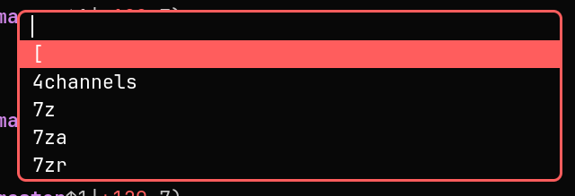
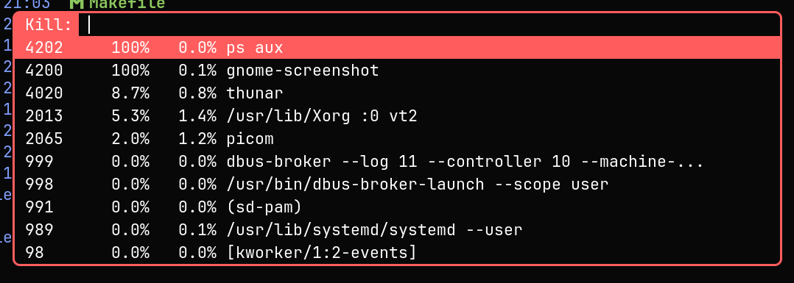
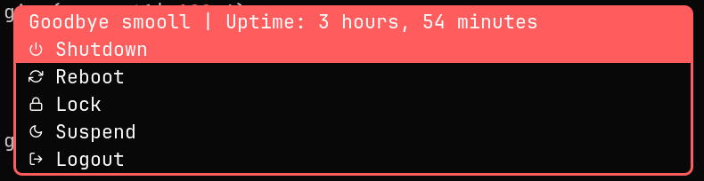
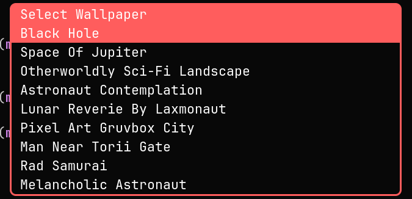

# [dmenu](https://tools.suckless.org/dmenu)
<p align="center">
    
</p>

dmenu is a dynamic menu for X, originally designed for dwm. It manages large numbers of user-defined menu items efficiently.

>[!NOTE]
>While dmenu is an application launcher, in this use case, it's mostly for scripts inside of [scripts/](https://github.com/smooll-d/suckless/tree/master/dmenu/scripts) which means that, you can't run dmenu with a shortcut inside of dwm, unless it's a script you're trying to run.

## Dependencies

- Xlib
- Xinerama (optional)
- fontconfig
- Xft

## Building and Installation
First, clone the repo:

```bash
$ git clone --depth=1 https://github.com/smooll-d/suckless.git
```

Next, cd into the dmenu subdirectory, build and install:

```bash
$ cd suckless/dmenu
$ sudo make clean install
```

## Scripts
This section will go over the available scripts inside of [scripts/](https://github.com/smooll-d/suckless/tree/master/dmenu/scripts).

>[!TIP]
>If you're on a Wayland compositor, with a few tweaks, you can still run these scripts no problem! You only need to install [mew](https://codeberg.org/unixchad/mew/src/branch/master).

### [killmenu](https://github.com/smooll-d/suckless/blob/master/dmenu/scripts/killmenu.sh)
<p align="center">
    
</p>

Killmenu, simplified, is `ps aux` in GUI form.

>[!TIP]
>If you're using a custom dmenu and are here just for the scripts, I recommend the amazing [fuzzymatch](https://tools.suckless.org/dmenu/patches/fuzzymatch/) patch for dmenu.
>It makes the searching for process much easier as without it, you'd have to type out everything to get to the process you want to kill. Literally everything, the PID, CPU and RAM usage, as well as the entire command.
>
>mew seems to already have fuzzy matching built it, you don't have to patch in anything yourself... ~~Lucky bastard.~~

It passes the output from `ps aux` into `awk` to extract the PID, CPU and RAM usage, as well as the command name of the process.

It sorts those processes based on the CPU usage from highest to lowest and passes them on to dmenu, so you can select which process you'd like to kill without typing a command and looking for the PID yourself.

### [powermenu](https://github.com/smooll-d/suckless/blob/master/dmenu/scripts/powermenu.sh)
>[!NOTE]
>If you're using a custom dmenu and are here just for the scripts, for the next two scripts, I recommend the [noinputlinesbelowpromptfullwidth](https://tools.suckless.org/dmenu/patches/no-input/) patch.
>It disables input to make the menus look aesthetically pleasing.

<p align="center">
    
</p>

Powermenu is just that, a power menu. It's literally it, select an option, confirm it and it's done.

#### A Little Disclaimer
If you're using a different window manager, logging out won't work for you and so, you'll have to change the source code of the script.
To do that, open the script in your favorite text editor and change the `${logout}` case of the switch statement at the bottom to your
logout command.

This goes for all cases in the switch statement.

### [wallpapermenu](https://github.com/smooll-d/suckless/blob/master/dmenu/scripts/wallpapermenu.sh)
<p align="center">
    
</p>

Wallpapermenu is wallpaper changer. To make it work, you need to pass the directory where your wallpapers reside, once you do that,
wallpapermenu will handle the rest of the work.

>[!CAUTION]
>The naming convention for your wallpapers is pretty important, if you want the names to look like the ones in the image.
>
>If you'd like to see how to name your wallpapers, look [here](https://github.com/smooll-d/dotfiles/tree/master/home/wallpapers)

#### Another Little Disclaimer
Make sure, if you're using something different than `feh` to set your wallpaper, to change the source code to use your wallpaper manager.

### [install.sh](https://github.com/smooll-d/suckless/blob/master/dmenu/scripts/install.sh)
If you ever create your own scripts that use dmenu for GUI and decide to put them here, running `install.sh` will automatically
copy your script to `/usr/local/bin` without you having to modify the script yourself, making it available system-wide.

## Patches
Patches reside inside of `patches/`:

- [border](https://tools.suckless.org/dmenu/patches/border/) - This patch adds a border around the dmenu window. It is intended to be used with the center or xyw patches, to make the menu stand out from similarly coloured windows.
- [case insensitive](https://tools.suckless.org/dmenu/patches/case-insensitive/) - This patch changes case-insensitive item matching to default behaviour. Adds an -s option to enable case-sensitive matching.
- [center](https://tools.suckless.org/dmenu/patches/center/) - This patch centers dmenu in the middle of the screen.
- [emoji-highlight](https://tools.suckless.org/dmenu/patches/emoji-highlight/) - This patch will allow for emojis on the left side with a colored background when selected.
- [fuzzyhighlight](https://tools.suckless.org/dmenu/patches/fuzzyhighlight/) - Make dmenu highlight the fuzzy matching characters of items. Best used alongside the fuzzymatch patch.
- [fuzzymatch](https://tools.suckless.org/dmenu/patches/fuzzymatch/) - Add support for fuzzy-matching to dmenu, enabling matching using non-consecutive portions of items.
- [noinputlinesbelowpromptfullwidth](https://tools.suckless.org/dmenu/patches/no-input/) - This patch removes the input box to create more aesthetic script menus. Only intended to be used with a prompt, otherwise there will be an empty box.
- [nosort](https://tools.suckless.org/dmenu/patches/no-sort/) - Adds the -S option to disable sorting menu items after matching. Useful, for example, when menu items are sorted by their frequency of use (using an external cache) and the most frequently selected items should always appear first regardless of how they were exact, prefix, or substring matches.
- [qalc](https://tools.suckless.org/dmenu/patches/qalc/) - Add a calculator mode to dmenu using qalc. Uses poll to update result on key press for smooth feedback.
