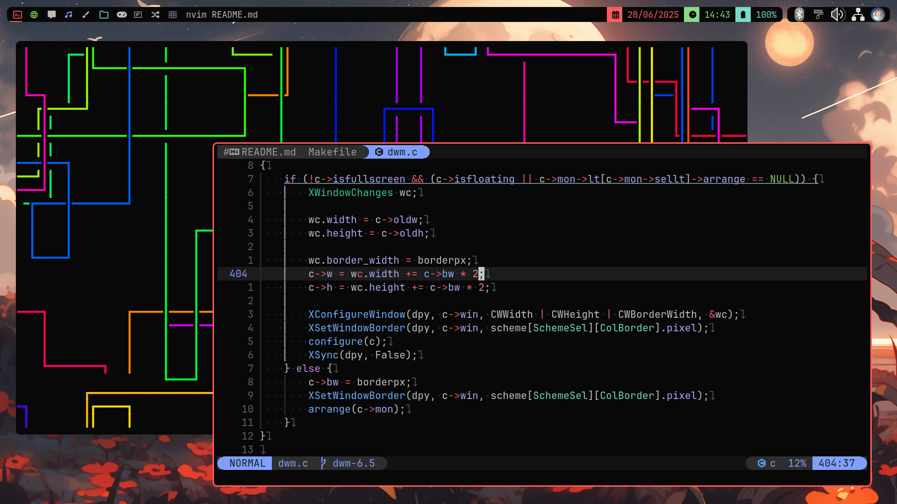

# [dwm](https://dwm.suckless.org)
<p align="center">
    
</p>

dynamic window manager.

## Dependencies
>[!CAUTION]
>Package names are for Arch Linux.

- base-devel
- libx11
- libxft
- libxinerama
- freetype2
- fontconfig
- ttf-jetbrains-mono-nerd
- st (terminal)

## Building and Installation
First, clone the repository:

```bash
$ git clone --depth=1 https://github.com/smooll-d/suckless.git
```

Enter `dwm/`:

```bash
$ cd suckless/dwm
```

Build and install:

```bash
$ sudo make clean install
```

dwm will be automatically built and installed together with a `.desktop` file for use with Display Managers/Login Managers like `lightdm`, `sddm` or `ly` (the one I use).

## Usage
>[!NOTE]
>`MOD` is the Windows key on your keyboard.

### Terminal
After you've entered into a dwm session, press `MOD+SHIFT+ENTER` to open the terminal, if you haven't installed st, exit using `MOD+SHIFT+Q`, return back to your previous environment, change the terminal in `config.h` to your preferred one, or just install st, much easier.

### Application Launcher
To open the application launcher you'll have to have `rofi` installed, then just press `MOD+R` to open it.

### Powermenu
To open a powermenu (also using `rofi`), press `MOD+F4`.

### Switching Between Workspaces/Tags
To switch between workspaces/tags, use `MOD+[1-9]`. `MOD+0` will show you all workspaces/tags at once.

### File Explorer
To open a file explorer (the default one is `thunar`), use `MOD+SHIFT+E`.

These are kind of the most important keybinds you have to know. If you'd like to see more of them, head on over to `config.h` and scroll down until the `keys` array of type `Key`.

### dmenu Scripts
My config of dmenu comes with a few handful scripts:

- killmenu (`MOD+K`) - `kill -9` in GUI form.
- powermenu (`MOD+F4`) - a power menu
- wallpapermenu (`MOD+W`) - wallpaper selection menu and setter with the help of feh (changeable)
- calculator (`MOD+Q`) - literal calculator built into dmenu curtesy of the amazing [qalc](https://tools.suckless.org/dmenu/patches/qalc/) patch

>[!CAUTION]
>You can't launch the default application launcher with a shortcut, as I use rofi for that.

For a more in-depth explanation of these scripts and how they look in action, go [here](https://github.com/smooll-d/suckless/blob/master/dmenu/README.md)

**HAVE FUN!**

## Patches
Patches reside inside of `patches/`, it has all the patches I currently use:

>[!NOTE]
>Some of these patches were made by me in which case, the name of the patch will be in **bold**.

- [actualfullscreen](https://dwm.suckless.org/patches/actualfullscreen/) - Actually toggle fullscreen for a window, instead of toggling the status bar and the monocle layout.
- [adjacenttag](https://dwm.suckless.org/patches/adjacenttag/) - This patch allow to focus on the adjacent tag (left or right) or move a client to it
- [alwayscenter](https://dwm.suckless.org/patches/alwayscenter/) - All floating windows are centered, like the center patch, but without a rule.
- [bar height](https://dwm.suckless.org/patches/bar_height/) - This patch allows user to change dwm's default bar height.

>[!NOTE]
>In this configuration, bar-height-spacing is used as opposed to the first version.

- **colorfultags** - Allows tags to have their own individual colors (credit to [@fitrh](https://github.com/fitrh) for creation)
- **colorfultags-activetagsonly** - A version of colorfultags that colors all tags with windows in them, not only the current tag

- [cool autostart](https://dwm.suckless.org/patches/cool_autostart/) - Allow dwm to execute commands from autostart array in your config.h file. And when you exit dwm all processes from autostart array will be killed.
- [restartsig](https://dwm.suckless.org/patches/restartsig/) - dwm can now be restarted via MOD+CTRL+SHIFT+Q or by kill -HUP dwmpid

>[!NOTE]
>`cool autostart` and `restartsig` are combined into one patch with some changes made by me that prevent `cool autostart` from killing and restarting  autostarted apps after a restart (`MOD+CTRL+SHIFT+Q` or `kill -HUP dwmpid`).

- [decoration hints](https://dwm.suckless.org/patches/decoration_hints/) - Make dwm respect _MOTIF_WM_HINTS property, and not draw borders around windows requesting for it. Some applications use this property to notify window managers to not draw window decorations.
- [fixborders](https://dwm.suckless.org/patches/alpha/) - By default dwm might make windows' borders transparent when using composit window manager (e.g. xcompmgr, picom). Alpha patch allows to make borders opaque.
- [fullgaps](https://dwm.suckless.org/patches/fullgaps/) - This patch adds gaps between client windows.
- [preserveonrestart](https://dwm.suckless.org/patches/preserveonrestart/) - By default, when dwm is recompiled-restarted all clients will lose it's current tag and collapse to first tag. This patch preserves clients on old tags, however note that layout order is not preserved.
- **removeboxes** - This patch removes the rectangles next to tags as well as the rectangle indicating if there's a floating window in a tag.
- [status2d](https://dwm.suckless.org/patches/status2d/) - Status2d allows colors and rectangle drawing in your DWM status bar. See below an example of my status bar with multi-cpu and battery.
- [barpadding](https://dwm.suckless.org/patches/barpadding/) - This patch adds variables for verticle and horizontal space between the statusbar and the edge of the screen
- [systray](https://dwm.suckless.org/patches/systray/) - A simple system tray implementation. Multi-monitor is also supported. The tray follows the selected monitor.

>[!NOTE]
>`status2d`, `barpadding` and `systray` are combined into one patch to make the effect of the bar and systray being decoupled from the top of the screen. There are changes I made to this patch that create a gap between the systray and rest of the bar.

- [statuscmd](https://dwm.suckless.org/patches/statuscmd/) - This patch adds the ability to signal a status monitor program such as dwmblocks the location and button when clicking on the status bar. Alternatively, there is a version that executes shell commands defined in config.h instead of using signals.

>[!NOTE]
>While it might look like `status2d` and `statuscmd` are combined, they are not. The diff file is named like that because it adds functionality on top of a build already patched with `status2d`.

- [sticky](https://dwm.suckless.org/patches/sticky/) - Press MODKEY+s (default) to make a client 'sticky'. A sticky client is visible on all tags. This is similar to setting the client's tags to all 1's, but with the ability to easily return it to its original tag by toggling it off by pressing MODKEY+s again.
- [underlinetags](https://dwm.suckless.org/patches/underlinetags/) - Underlines selected tags. This looks good for certain color schemes.
- **unfocusednoborders** - This patch removes borders from unfocused windows and adds them back in once in a focused state (e.g. once hovered over).
- **unfocusednoborders-floating** - This patch does the same as the above, but also removes borders on floating windows and doesn't touch fullscreen windows.
- [winicon](https://dwm.suckless.org/patches/winicon/) - dwm-winicon is a patch that enables dwm to show window icons.

>[!NOTE]
>`unfocusednoborders` and `removeboxes` are currently committed to dwm's patches wiki, so maybe, some day, these two patches will be on the official wiki and their names will turn into links. `colorfultags` is not made by me, I just made the code into the patch (half the code, I don't care about title colors). I'm currently waiting for permission to upload the patch to the wiki.
