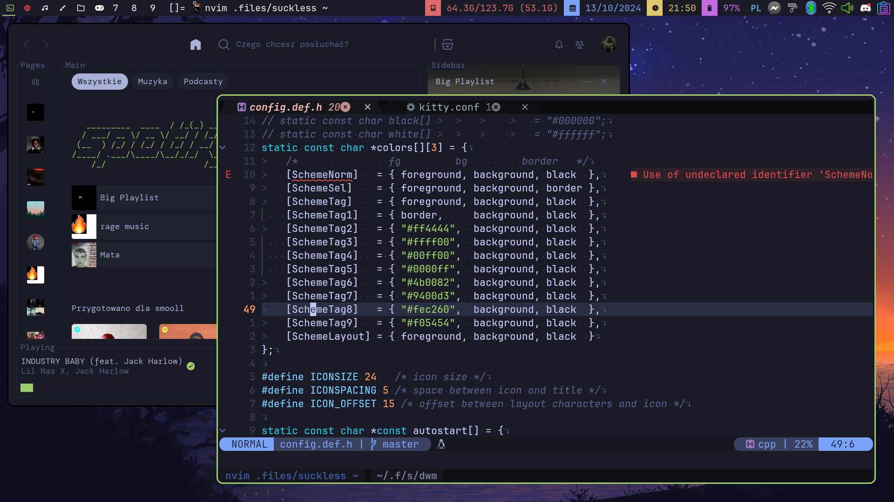

# dwm
<p align="center">
    
</p>

## Dependencies
>[!CAUTION]
>Every package name is the same as on Arch Linux so, you'll have to find your distro's equivalent. It's what I use personally, so deal with it.

- base-devel
- libx11
- libxft
- libxinerama
- freetype2
- fontconfig
- ttf-jetbrains-mono-nerd
- st (terminal)

## Installation
>[!CAUTION]
>These installation guides assume you're in the same directory as the `README.md` file you're reading right now.

```bash
$ cd dwm/
$ sudo make clean install
```

There shouldn't be any errors, unless you don't have some dwm dependency.

I'm not going to show you how to make dwm run on login or anything like that, you can figure it out on your own plus I'm too lazy to explain everything, but basically you have to make an `Xsession` file and install a `Display Manager` like [sddm](https://github.com/sddm/sddm) (which is what I personally use) or [lightdm](https://github.com/canonical/lightdm).

## Patches
Here's a list of patches that reside in the `patches/` directory and an excerpt from dwm's patches website describing what they do (I don't remember if all of them are applied):

>[!NOTE]
> `status2d` and `systray` patches are combined into one to fix positioning of the bar and systray.

- actualfullscreen - Actually toggle fullscreen for a window, instead of toggling the status bar and the monocle layout.
- adjecenttag - This patch allow to focus on the adjacent tag (left or right) or move a client to it, the version with 'skipvacant' will skip vacant tags
- alwayscenter - All floating windows are centered, like the center patch, but without a rule.
- bar height spacing - This patch allows user to change dwm's default bar height.
- cool autostart - Allow dwm to execute commands from autostart array in your config.h file. And when you exit dwm all processes from autostart array will be killed. Added a feature that will not kill and start apps if dwm is restarted using the `restartsig` patch.
- decoration hints - Make dwm respect \_MOTIF_WM_HINTS property, and not draw borders around windows requesting for it. Some applications use this property to notify window managers to not draw window decorations. Not respecting this property leads to issues with applications that draw their own borders, like chromium (with "Use system title bar and borders" turned off) or vlc in fullscreen mode.
- fixborders - Fixes borders so that they're not transparent anymore when using picom.
- fullgaps - Adds gaps between client windows.
- preserveonrestart - By default, when dwm is recompiled-restarted all clients will lose it's current tag and collapse to first tag. This patch preserves clients on old tags, however note that layout order is not preserved.
- restartsig - dwm can now be restarted via MOD+CTRL+SHIFT+Q or by kill -HUP dwmpid. In addition, a signal handler was added so that dwm cleanly quits by kill -TERM dwmpid.
- status2d - Allows colors and rectangle drawing in your DWM status bar.
- statuscmd - This patch adds the ability to signal a status monitor program such as dwmblocks the location and button when clicking on the status bar. Alternatively, there is a version that executes shell commands defined in config.h instead of using signals.
- sticky - Press MODKEY+s (default) to make a client 'sticky'. A sticky client is visible on all tags. This is similar to setting the client's tags to all 1's, but with the ability to easily return it to its original tag by toggling it off by pressing MODKEY+s again.
- systray - A simple system tray implementation. Multi-monitor is also supported. The tray follows the selected monitor.
- underlinetags - Underlines selected tags.
- colorful tags - A fork of rainbowtags by [@fitrh](https://github.com/fitrh) (this patch is not in the patches folder as it does not have a .diff file and had to be implemented by me).
- winicon - Shows app icons next to the title of the app.

Restart dwm if you're already using it while installing dwmblocks (Windows key + control + shift + q) and voila! Your dwm **should** look the same as in the image above. I'm not talking about Spotify nor the terminal or NeoVim.
