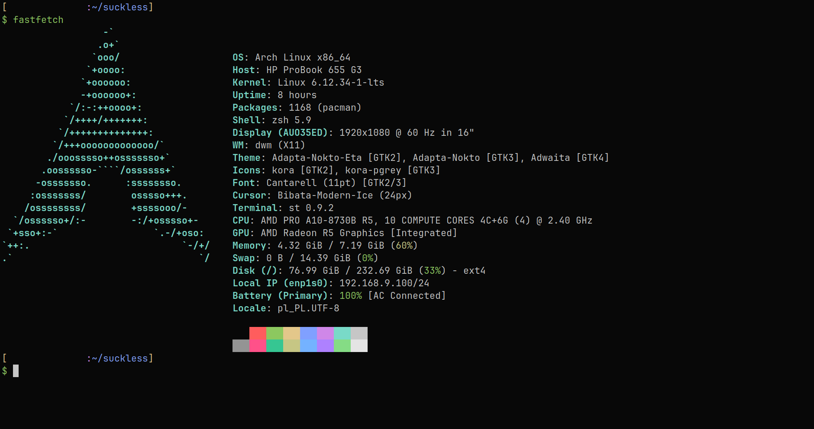

# [st](st.suckless.org)
<p align="center">
    
</p>

## Dependencies
>[!CAUTION]
>Package names are for Arch Linux.

- base-devel
- libx11
- libxft
- fontconfig
- ncurses
- ttf-jetbrains-mono-nerd

## Building and Installation
First, clone the repository:

```bash
$ git clone --depth=1 https://github.com/smooll-d/suckless.git
```

Enter `st/`:

```bash
$ cd suckless/st
```

Build and install:

```bash
$ sudo make clean install
```

This version of `st` comes with a `.desktop` file that makes it possible to select it in any application launcher (e.g. `rofi`).

## Patches
Here's a list of patches inside of the `patches/` directory:

- [anysize](https://st.suckless.org/patches/anysize/) - This patch allows st to resize to any pixel size, makes the inner border size dynamic, and centers the content of the terminal so that the left/right and top/bottom borders are balanced. With this patch, st on a tiling WM will always fill the entire space allocated to it.
- [blinking cursor](https://st.suckless.org/patches/blinking_cursor/) - This patch allows the use of a blinking cursor.
- [bold is not bright](https://st.suckless.org/patches/bold-is-not-bright/) - In st, bold text is rendered with a bold font in the bright variant of the current color. This patch makes bold text rendered simply as bold, leaving the color unaffected.
- [boxdraw](https://st.suckless.org/patches/boxdraw/) - Custom rendering of lines/blocks/braille characters for gapless alignment.
- [clipboard](https://st.suckless.org/patches/clipboard/) - This trivial patch sets CLIPBOARD on selection, the same as your browser.
- [colorschemes](https://st.suckless.org/patches/colorschemes/) - This patch adds multiple color schemes and lets you change them without having to restart st.

>[!NOTE]
>Built st only has one colorscheme, that being moonfly.

- [desktopentry](https://st.suckless.org/patches/desktopentry/) - Creates a desktop-entry for st. This enables to find st in a graphical menu and to display it with a nice icon.
- [dynamic cursor color](https://st.suckless.org/patches/dynamic-cursor-color/) - Swaps the colors of your cursor and the character you're currently on (much like alacritty). Some say the effect is very appealing:)
- [glyph wide support](https://st.suckless.org/patches/glyph_wide_support/) - This patch fixes wide glyphs truncation. This patch is based from Lukesmithxyz/st's commit on github

>[!NOTE]
>`glyph-wide-support-boxdraw` is used instead of the regular version.

- [hidecursor](https://st.suckless.org/patches/hidecursor/) - Hide the X cursor whenever a key is pressed and show it back when the mouse is moved in the terminal window.
- [scrollback](https://st.suckless.org/patches/scrollback/) - Scroll back through terminal output using Shift+{PageUp, PageDown}.

>[!NOTE]
>`scrollback` comes in three patches, `scrollback-ringbuffer`, `scrollback-mouse-altscreen` and `scrollback-mouse-increment`.
>They allow for more efficient scrolling, mouse scrolling and changing the speed of the scroll respectively. You can still scroll with Shift+{PageUp, PageDown} and speed changing of scroll is not exclusive to mouse (I don't really know if it works though).

- [title parsing fix](https://st.suckless.org/patches/title_parsing_fix/) - Window titles in st get truncated after the first ';' character. I don't know whether this is the expected behaviour but all terminals I have come across do not truncate (for instance xterm, termite and alacritty). This patch "fixes" that behaviour.
- [undercurl](https://st.suckless.org/patches/undercurl/) - This patch adds support for special underlines
- [workingdir](https://st.suckless.org/patches/workingdir/) - This patch allows user to specify the initial path st should use as WD (working directory).
